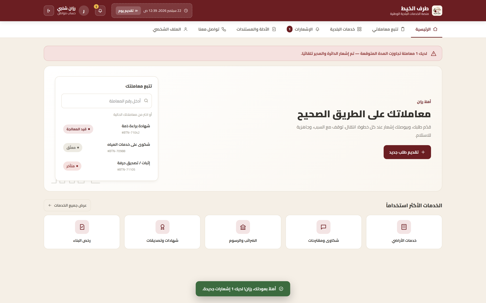
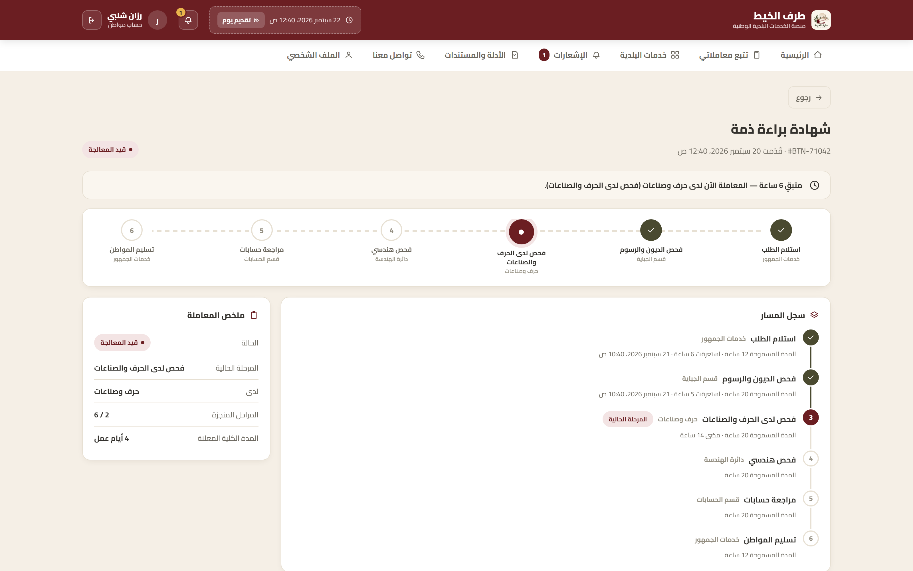
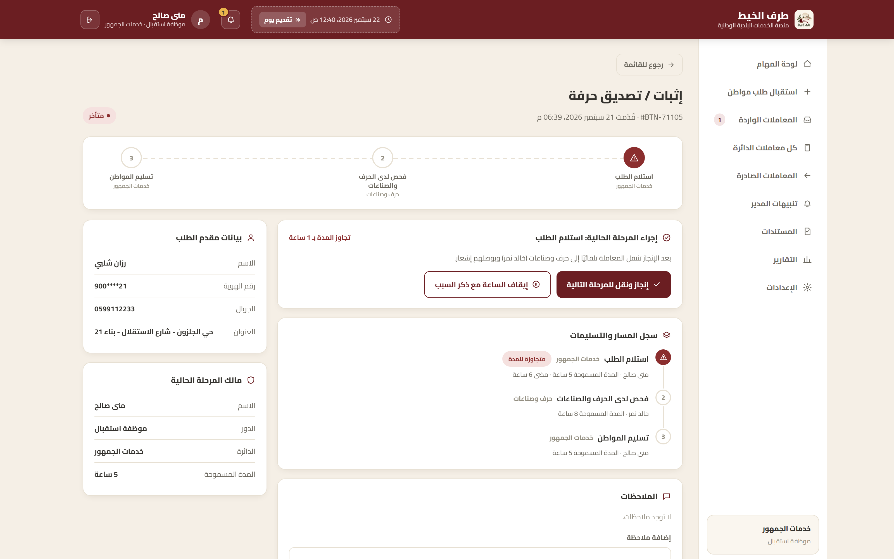
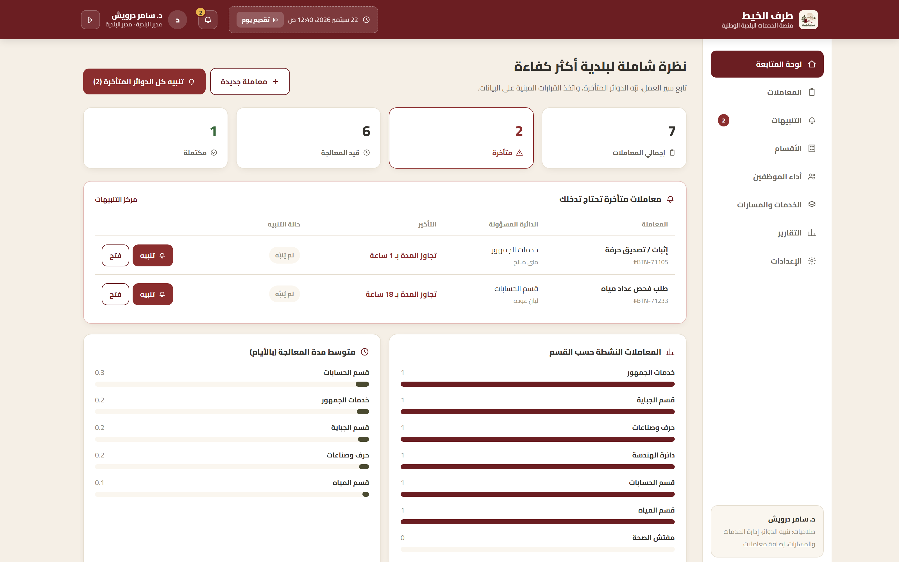

<div align="center">


# طرف الخيط — Tarf Al-Khait

**Municipal transaction accountability platform.** 🏆 Hackathon winner.

[**Live demo**](https://taraf-al-khait.netlify.app/) · [Screenshots](#screenshots) · [Demo accounts](#demo-accounts)

</div>

---

## Overview

Tarf Al-Khait gives every municipal transaction a single accountable owner, a visible path across departments, a documented reason whenever the clock is paused, and automatic escalation before deadlines are missed.

## Problem

A municipal transaction moves between departments with no single accountable owner. Handoffs depend on individual employee judgment rather than a documented process, so when a transaction stalls, no one — not the citizen, often not even the employees — can say who is responsible or why.

This was confirmed through interviews with employees at Ramallah and Al-Bireh municipalities: department coordination happens by informal phone call, not a shared system. Written procedures exist; they are not what actually happens.

## Solution

| Thread | Answers |
|---|---|
| **مين مسؤول** — Case Owner | Who owns this transaction right now, across every department it touches |
| **وين واصلة** — Workflow Engine | Where it is in the process, recorded as a digital "passport" per stage |
| **ليش توقفت** — Service Clock | Why the clock is paused — a written reason, not silence |
| **مين يتدخل** — Escalation | Who is automatically notified before the deadline is missed |

## Features

- **Citizen portal** — service catalog (26 municipal services), request submission, live tracking, notifications, profile, direct department inquiries.
- **Employee workspace** (per department) — task queue, case actions (advance / pause with reason / notes), walk-in intake for citizens who didn't apply online.
- **Manager dashboard** — live overview, department delay alerts with reply tracking, service & route builder, ability to create a transaction for any citizen.

Single self-contained HTML file — no build step, no server, no install.

## Run it

**Live:** https://taraf-al-khait.netlify.app/

**Locally:** open `app/index.html` in a browser.

## Demo accounts

Password `1234` for every account.

| Role | Login |
|---|---|
| Citizen | `900447821` (رزان شلبي) or `900552817` (خالد إبراهيم) |
| Employee — خدمات الجمهور | `mona` |
| Employee — قسم الجباية | `samer` |
| Employee — حرف وصناعات | `khaled` |
| Employee — دائرة الهندسة | `ahmad` |
| Employee — قسم الحسابات | `layan` |
| Employee — قسم المياه | `mohammad` |
| Employee — مفتش الصحة | `heba` |
| Manager / Director | `director` |

## Screenshots

<table>
<tr>
<td><br/><sub>Citizen portal</sub></td>
<td><br/><sub>Transaction tracking</sub></td>
</tr>
<tr>
<td><br/><sub>Employee case detail</sub></td>
<td><br/><sub>Manager dashboard</sub></td>
</tr>
</table>

## Tech stack

React 18 + Babel Standalone (in-browser JSX compilation, no build tooling).

## Repo structure

```
app/            product source — app/index.html
docs/           deployment build (served by Netlify)
pitch-deck/     final pitch deck
assets/         logo, screenshots
```

## Team

Razan Shalabi, Lina Hamad, Jana Hijaz.
